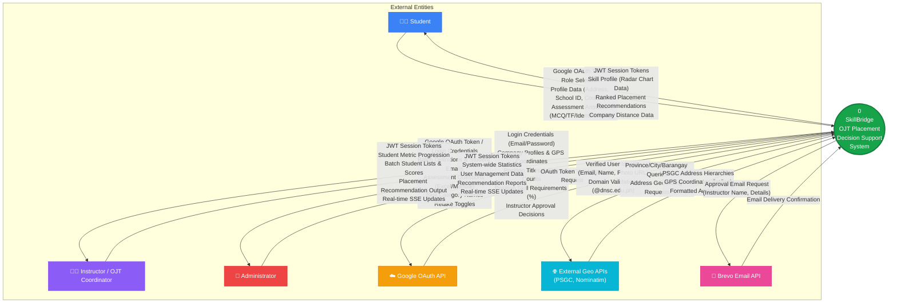
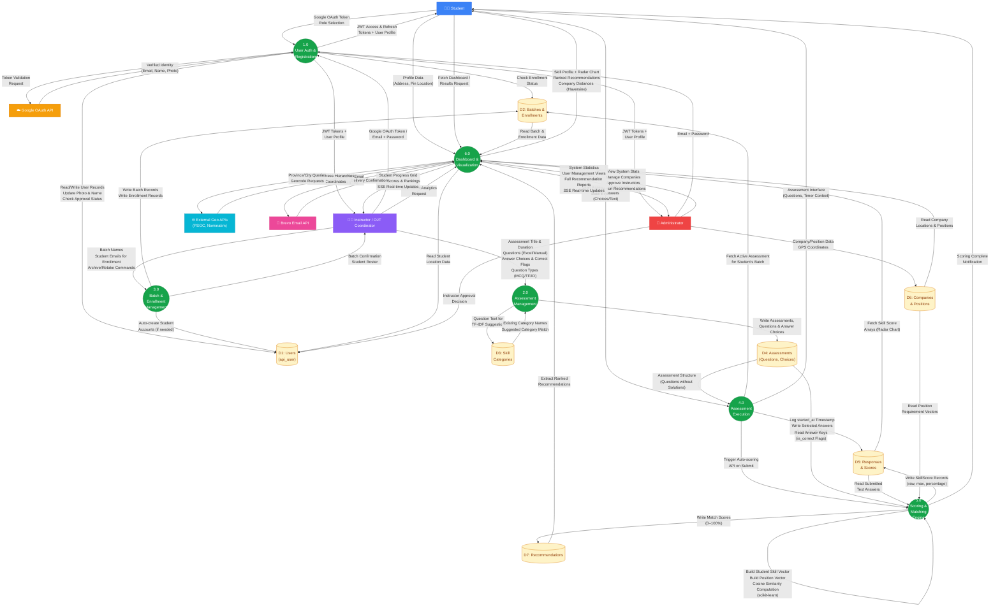

# Data Flow Diagram (DFD) — SkillBridge
**Web-Based OJT Placement Decision Support System**

---

## 1. System Overview
SkillBridge is a specialized web-based decision support system designed specifically for the Davao del Norte State College (DNSC) OJT placement program. Its primary goal is to digitize and improve the manual assessment process used to place IT students into appropriate internship roles. The system allows OJT coordinators to upload skill-based questionnaires, which are automatically scored via the platform when completed by students.

Using Natural Language Processing (NLP) text normalization and algorithms like TF-IDF, the system processes responses dynamically. Finally, the system builds student skill vectors and runs a cosine similarity matching algorithm against company position demands to provide accurate and highly ranked placement recommendations without taking away the final assignment autonomy of the instructors.

---

## 2. Identified Components

### 2.1 External Entities
| Entity | Description |
|--------|-------------|
| **Student** | DNSC students (with `@dnsc.edu.ph` email) seeking OJT placements. They register via Google OAuth, complete profile setup (address, school ID, course), take skill assessments, and view ranked placement recommendations. |
| **Instructor (OJT Coordinator)** | Faculty members who create student batches, enroll students, upload/create assessments (via Excel or manual entry), manage skill categories, toggle retakes, and review student performance and placement recommendations. |
| **Administrator** | System administrator who approves instructor registrations, manages company profiles and position requirements, views system-wide statistics, and can re-run recommendation algorithms. |
| **Google OAuth Service** | External authentication provider (`googleapis.com/oauth2/v3/userinfo`) that validates student and instructor identities, restricting access to verified `@dnsc.edu.ph` Google accounts only. |
| **External Geographical APIs (PSGC / Nominatim)** | Philippine Standard Geographic Code (PSGC) API for cascading Province → City → Barangay address dropdowns; Nominatim for geocoding addresses to latitude/longitude coordinates for distance-based company proximity calculations. |
| **Brevo Email API** | Transactional email service used to send approval notification emails to instructors when their accounts are approved by the administrator. |

### 2.2 Processes
| Process | Description |
|---------|-------------|
| **1.0 User Authentication & Registration** | Authenticates users via Google OAuth (students/instructors) or email+password credentials (admin/instructor). Manages JWT session tokens (access + refresh), role selection, account approval workflows, and enrollment verification. |
| **2.0 Assessment Management** | Enables instructors to create, upload (Excel/manual), and manage skill assessments. Handles question creation (MCQ, True/False, Identification), answer choice storage, TF-IDF-based skill category suggestion, and assessment activation/deactivation. |
| **3.0 Batch & Enrollment Management** | Allows instructors to create student batches, enroll students (auto-creating accounts if needed), manage student rosters (remove/retake), and archive completed batches. |
| **4.0 Assessment Execution** | Manages the student assessment-taking flow: session initialization with timer tracking (`started_at`), answer collection with autosave, and final submission with timestamp recording (`submitted_at`). |
| **5.0 Scoring & Matching Engine** | The core NLP/algorithmic engine that: (a) auto-grades submitted answers using text normalization for identification questions, (b) computes per-category skill score percentages, (c) builds numerical skill vectors, and (d) executes cosine similarity matching against position requirement vectors to generate ranked placement recommendations. |
| **6.0 Dashboard & Visualization** | Synthesizes system data into role-specific dashboards: student skill profiles with radar charts and ranked recommendations, instructor batch analytics with student progress tracking, and admin system-wide statistics with company management views. Includes real-time SSE updates. |

### 2.3 Data Stores
| Data Store | Tables | Description |
|------------|--------|-------------|
| **D1: Users** | `api_user` | Stores user credentials, roles (`student`/`instructor`/`admin`), school ID, course, phone, address (JSONField with home/boarding/pin coordinates), photo URL, approval status, and timestamps. |
| **D2: Batches & Enrollments** | `batches`, `batch_enrollments` | Represents student groupings created by instructors. Tracks batch status (active/archived), instructor ownership, and student-to-batch enrollment records with timestamps. |
| **D3: Skill Categories** | `skill_categories` | Dynamically created taxonomy of competency areas (e.g., "Web Development", "Database Management"). Created by instructors/admins, used to tag assessment questions and define position requirements. |
| **D4: Assessments** | `assessments`, `questions`, `answer_choices` | Stores assessment metadata (title, duration, active status), individual questions (text, type, category mapping, ordering), and answer choices with correctness flags (`is_correct`). |
| **D5: Responses & Scores** | `student_responses`, `response_answers`, `skill_scores` | Archives assessment sessions (start/submit timestamps, retake flags), individual answer selections (choice ID or text answer), and computed per-category skill score percentages. |
| **D6: Companies & Positions** | `companies`, `positions`, `position_requirements` | Stores company profiles (name, address JSONField, GPS coordinates), internship positions (title, available slots), and per-position skill category requirement percentages. |
| **D7: Recommendations** | `recommendations` | Preserves cosine similarity match scores (0–100%) between each student and each position, with generation timestamps. |

---

## 3. Data Flow Narrative

The data flows across SkillBridge in six logical stages:

1. **Authentication Flow:** Students and instructors authenticate via Google OAuth — the system validates tokens against the Google API, checks for `@dnsc.edu.ph` domain restriction, and issues JWT session tokens. Administrators authenticate with email/password credentials. New users select a role (student/instructor) during first-time registration. Students must be pre-enrolled by an instructor before login is permitted.

2. **Batch & Enrollment Flow:** Instructors create named batches (e.g., "AY 2025-2026") and enroll students by email. If a student account does not exist, the system auto-creates one with an unusable password (student will log in via Google). Enrollment records link students to batches.

3. **Assessment Creation Flow:** Instructors create assessments with questions via manual entry or Excel upload. During question creation, the TF-IDF function analyzes question text against existing skill category names to suggest appropriate category tags. Upon confirmation, questions, answer choices, and category links are saved.

4. **Assessment Execution Flow:** Students receive their batch's active assessment. Starting an assessment records `started_at` for timer anti-cheat. Answers are autosaved client-side and submitted to the server, which records `submitted_at` and all selected choices/text answers.

5. **Scoring & Recommendation Flow:** Upon submission, the Scoring Engine: (a) grades each answer — MCQ/TrueFalse via `is_correct` flag lookup, Identification via NLP text normalization (`.strip().lower()`) for case-insensitive matching; (b) computes per-category skill score percentages; (c) builds a numerical skill vector `[0.82, 0.55, 0.30, ...]`; (d) constructs position requirement vectors in the same dimensional space; (e) computes cosine similarity scores via scikit-learn; and (f) stores ranked recommendations in the database.

6. **Visualization & Analytics Flow:** Role-specific dashboards render the processed data: students see their skill profile radar charts and ranked company recommendations with distance calculations; instructors view batch-level student progress, scores, and top placement matches; administrators access system-wide statistics, company/position management, and can re-run recommendation algorithms. Real-time SSE streams notify admin and instructor panels of data changes.

---

## 4. Level 0 DFD — Context Diagram

The Context Flow Diagram depicts the SkillBridge system as a single process, showing how it interacts with all external entities and the data each interaction requires and produces.

### Level 0 DFD Data Flow Summary Table

| # | Source → Destination | Data Flow | Direction |
|---|---------------------|-----------|-----------|
| 1 | Student → System | Google OAuth Token, Role Selection, Profile Data (address, school ID, course, phone, map pin), Assessment Answers (selected choices, typed text) | Inbound |
| 2 | System → Student | JWT Tokens (access + refresh), Skill Score Profile, Ranked Company/Position Recommendations with Match Scores, Nearby Company Distances | Outbound |
| 3 | Instructor → System | Google OAuth Token / Email+Password, Batch Names, Student Emails for Enrollment, Assessment Questions (Excel/Manual), Skill Category Names, Retake Toggles | Inbound |
| 4 | System → Instructor | JWT Tokens, Student Progress Data (submitted/pending), Per-category Skill Scores, Top Placement Recommendations per Student, SSE Real-time Updates | Outbound |
| 5 | Administrator → System | Email + Password Credentials, Company Profiles (name, address, GPS coords), Positions (title, slots), Position Requirements (skill category → percentage), Instructor Approval/Rejection | Inbound |
| 6 | System → Administrator | JWT Tokens, System Statistics (user counts, submission counts), User Lists, Full Recommendation Reports, SSE Real-time Updates | Outbound |
| 7 | System ↔ Google OAuth API | Token Validation Request → Verified Identity (email, name, photo), `@dnsc.edu.ph` Domain Check | Bidirectional |
| 8 | System ↔ External Geo APIs | Province/City/Barangay Queries → PSGC Hierarchies; Address Text → GPS Coordinates (Nominatim) | Bidirectional |
| 9 | System → Brevo Email API | Instructor Approval Notification Email → Delivery Confirmation | Outbound |

---

## 5. Level 1 DFD — Decomposed Sub-Processes

The Level 1 DFD decomposes the single Level 0 process into six sub-processes, showing internal data flows between processes and data stores while retaining all external entities and data flows from the Context Diagram.

### Level 1 DFD — Process-to-Data Store Flow Matrix

This matrix shows which processes read from (R) or write to (W) each data store:

| Data Store | P1.0 Auth | P2.0 Assessment Mgt | P3.0 Batch Mgt | P4.0 Execution | P5.0 Scoring | P6.0 Dashboard |
|:----------:|:---------:|:-------------------:|:--------------:|:--------------:|:------------:|:--------------:|
| **D1: Users** | R/W | — | W | — | — | R |
| **D2: Batches** | R | — | R/W | R | — | R |
| **D3: Categories** | — | R/W | — | — | — | — |
| **D4: Assessments** | — | W | — | R | R | — |
| **D5: Responses & Scores** | — | — | — | W | R/W | R |
| **D6: Companies** | — | — | — | — | R | R/W |
| **D7: Recommendations** | — | — | — | — | W | R |

### Level 1 DFD — External Entity Interactions Retained from Level 0

| External Entity | Interacts With Process(es) | Data In | Data Out |
|----------------|---------------------------|---------|----------|
| **Student** | P1.0, P4.0, P5.0, P6.0 | OAuth Token, Role, Profile, Answers | JWT, Skill Profile, Recommendations, Distances |
| **Instructor** | P1.0, P2.0, P3.0, P6.0 | OAuth/Password, Questions, Batches, Student Emails | JWT, Student Progress, Scores, Rankings, SSE |
| **Administrator** | P1.0, P6.0, D1, D6 | Password, Companies, Positions, Requirements, Approvals | JWT, Stats, User Lists, Reports, SSE |
| **Google OAuth API** | P1.0 | Token Validation Request | Verified Identity (email, name, photo) |
| **External Geo APIs** | P6.0 | Province/City/Address Queries | PSGC Hierarchies, GPS Coordinates |
| **Brevo Email API** | P6.0 | Approval Email Payload | Delivery Confirmation |

---

## 6. Key Algorithms Referenced in the DFD

The following algorithms are the core intelligence within **Process 5.0 (Scoring & Matching Engine)** and are central to the system's Decision Support functionality:

### 6.1 Text Normalization (NLP Preprocessing)
- **Where:** Process 5.0 → Identification question grading
- **How:** `.strip().lower()` applied to both student answer and stored correct answer
- **Purpose:** Ensures "CPU", "cpu", and "  Cpu  " are treated as identical answers
- **Library:** Python built-in string methods

### 6.2 TF-IDF (Term Frequency–Inverse Document Frequency)
- **Where:** Process 2.0 → Category suggestion during question creation
- **How:** `TfidfVectorizer` converts question text and category names into weighted vectors; cosine similarity identifies the best-matching category
- **Purpose:** Automatically suggests which skill category a new question belongs to
- **Library:** `scikit-learn` (`TfidfVectorizer`)
- **Threshold:** Returns `None` if similarity < 0.05 (5%)

### 6.3 Cosine Similarity (Vector Space Model)
- **Where:** Process 5.0 → Recommendation generation
- **How:** Student skill percentages are normalized to `[0, 1]` vectors; position requirements form corresponding vectors in the same dimensional space; `cosine_similarity()` measures angular similarity
- **Purpose:** Produces ranked match scores (0–100%) between students and internship positions
- **Library:** `scikit-learn` (`cosine_similarity`), `numpy`

### 6.4 Haversine Distance
- **Where:** Process 6.0 → Dashboard distance calculations
- **How:** Frontend computes great-circle distance between student pin location and company GPS coordinates
- **Purpose:** Shows nearby companies and distance-based filtering on student dashboards

---

## 7. Summary for Defense/Documentation

This DFD mapping guarantees no conceptual abstraction represents a "black box." Every external entity, process, data store, and data flow has been traced directly to the actual codebase implementation:

- **Level 0** establishes the system boundary, identifying six external entities and documenting all data crossing that boundary.
- **Level 1** decomposes the system into six sub-processes, revealing internal data pathways and the seven data stores that persist system state.
- All external entities and their data flows from Level 0 are **retained** in Level 1, as required by DFD conventions.

The strict structure highlights why SkillBridge functions specifically as a structured **Decision Support System (DSS)**. It elegantly utilizes Information Retrieval (IR) heuristics — such as Cosine Similarity vector computations and TF-IDF term-document calculations — without outright forcing automation, granting actionable knowledge to the DNSC OJT Coordinator while preserving their final placement decision authority.
