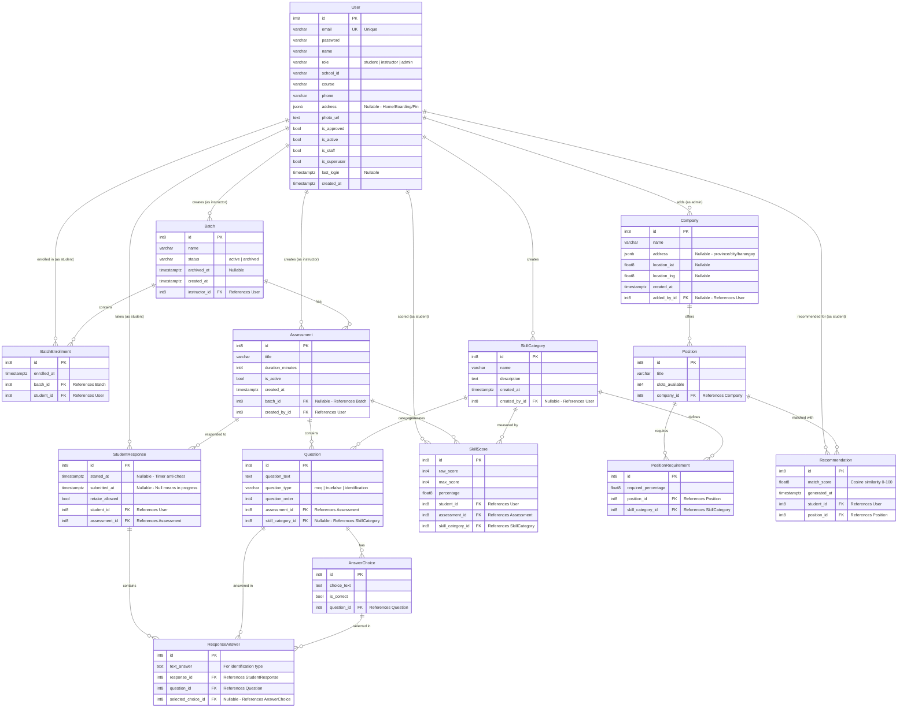

# Entity Relationship Diagram (ERD) — SkillBridge
**Web-Based OJT Placement Decision Support System**

---

## Database Overview

SkillBridge uses **PostgreSQL** (hosted on Supabase) with **14 application tables** organized into four logical groups:

| Group | Tables | Purpose |
|-------|--------|---------|
| **User Management** | User, Batch, BatchEnrollment | User accounts, student groupings, and enrollment records |
| **Assessment Engine** | SkillCategory, Assessment, Question, AnswerChoice | Skill taxonomy, test content, and answer keys |
| **Response & Scoring** | StudentResponse, ResponseAnswer, SkillScore | Student submissions, individual answers, and computed scores |
| **Placement Matching** | Company, Position, PositionRequirement, Recommendation | Company profiles, job requirements, and cosine similarity results |

---

## Entity Relationship Diagram



---

## Relationship Summary Table

| # | Parent Entity | Child Entity | Cardinality | Foreign Key | Constraint |
|---|---------------|-------------|-------------|-------------|------------|
| 1 | User | Batch | One-to-Many | `instructor_id` | CASCADE |
| 2 | User | BatchEnrollment | One-to-Many | `student_id` | CASCADE |
| 3 | Batch | BatchEnrollment | One-to-Many | `batch_id` | CASCADE |
| 4 | User | Assessment | One-to-Many | `created_by_id` | CASCADE |
| 5 | Batch | Assessment | One-to-Many | `batch_id` | SET_NULL |
| 6 | User | SkillCategory | One-to-Many | `created_by_id` | SET_NULL |
| 7 | Assessment | Question | One-to-Many | `assessment_id` | CASCADE |
| 8 | SkillCategory | Question | One-to-Many | `skill_category_id` | SET_NULL |
| 9 | Question | AnswerChoice | One-to-Many | `question_id` | CASCADE |
| 10 | User | StudentResponse | One-to-Many | `student_id` | CASCADE |
| 11 | Assessment | StudentResponse | One-to-Many | `assessment_id` | CASCADE |
| 12 | StudentResponse | ResponseAnswer | One-to-Many | `response_id` | CASCADE |
| 13 | Question | ResponseAnswer | One-to-Many | `question_id` | CASCADE |
| 14 | AnswerChoice | ResponseAnswer | One-to-Many | `selected_choice_id` | SET_NULL |
| 15 | User | SkillScore | One-to-Many | `student_id` | CASCADE |
| 16 | Assessment | SkillScore | One-to-Many | `assessment_id` | CASCADE |
| 17 | SkillCategory | SkillScore | One-to-Many | `skill_category_id` | CASCADE |
| 18 | User | Company | One-to-Many | `added_by_id` | SET_NULL |
| 19 | Company | Position | One-to-Many | `company_id` | CASCADE |
| 20 | Position | PositionRequirement | One-to-Many | `position_id` | CASCADE |
| 21 | SkillCategory | PositionRequirement | One-to-Many | `skill_category_id` | CASCADE |
| 22 | User | Recommendation | One-to-Many | `student_id` | CASCADE |
| 23 | Position | Recommendation | One-to-Many | `position_id` | CASCADE |

---

## Unique Constraints

| Table | Columns | Purpose |
|-------|---------|---------|
| User | `email` | Prevents duplicate accounts |
| BatchEnrollment | `(batch_id, student_id)` | Prevents double enrollment |
| StudentResponse | `(student_id, assessment_id)` | One response per student per assessment |
| SkillScore | `(student_id, assessment_id, skill_category_id)` | One score per student per category per assessment |
| PositionRequirement | `(position_id, skill_category_id)` | One requirement per category per position |
| Recommendation | `(student_id, position_id)` | One recommendation per student per position |

---

## JSONField Structures

### User.address
```json
{
  "stayingAt": "home | boarding",
  "travelWilling": "yes | no",
  "home": {
    "province": "Davao del Norte",
    "city": "Panabo City",
    "barangay": "San Francisco"
  },
  "boarding": {
    "province": "...",
    "city": "...",
    "barangay": "..."
  },
  "pinLat": 7.3087,
  "pinLng": 125.6841
}
```

### Company.address
```json
{
  "province": "Davao del Norte",
  "city": "Tagum City",
  "barangay": "Poblacion"
}
```
